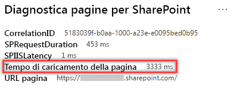

# Ottimizzare le chiamate di pagina nelle pagine classiche e moderne del sito di pubblicazione di SharePoint Online

Sia i siti di pubblicazione moderni che quelli classici di SharePoint Online contengono collegamenti che caricano i dati dalle (o effettuano chiamate a) funzionalità di SharePoint e CDN. Per altre chiamate effettuate da una pagina, il caricamento della pagina sarà più lungo. Si tratta di una **latenza percepita dagli utenti finali** o **EUPL**.

Questo articolo illustra come determinare il numero e l'impatto delle chiamate agli endpoint esterni nelle pagine moderne e classiche del sito di pubblicazione e su come limitarne l'effetto sulla latenza percepita dagli utenti finali.

>[!NOTE]
>Per ulteriori informazioni sulle prestazioni nei portali moderni di SharePoint Online, vedere [ Prestazioni nell'esperienza moderna di SharePoint](https://docs.microsoft.com/sharepoint/modern-experience-performance).

## Usare lo strumento Diagnostica pagine per SharePoint per analizzare le chiamate di pagine

Lo strumento Diagnostica pagine per SharePoint è un'estensione del browser per il nuovo browser Microsoft Edge (https://www.microsoft.com/edge) e per Chrome che consente di analizzare le pagine del sito di pubblicazione di SharePoint Online sia classiche che dei portali moderni. Per ogni pagina analizzata lo strumento fornisce un report che mostra le prestazioni della pagina rispetto a un set definiti di criteri delle prestazioni. Per installare e conoscere lo strumento Diagnostica pagine per SharePoint, visitare [Usare lo strumento Diagnostica pagine per SharePoint Online](page-diagnostics-for-spo.md).

>[!NOTE]
>Lo strumento Diagnostica pagine funziona solo per SharePoint Online e non può essere usato in una pagina di sistema di SharePoint.

Quando si analizza una pagina del sito di SharePoint con lo strumento Diagnostica pagine per SharePoint, è possibile visualizzare le informazioni sulle chiamate esterne nel risultato **Richieste a SharePoint** nel riquadro _Test diagnostici_. La riga sarà verde se la pagina del sito contiene una quantità inferiore della linea di base di chiamate, mentre sarà rossa se la pagina supera il numero di linea di base. Il numero della linea di base varia in base alle pagine moderne e classiche, perché le pagine classiche del sito usano HTTP1.1, mentre le moderne usano HTTP2.0:

- Le pagine moderne del sito non dovrebbero contenere più di **25** chiamate
- Le pagine classiche del sito non dovrebbero contenere più di **6** chiamate

I risultati possibili includono:

- **Attenzione richiesta** (rosso): la pagina supera il numero di linea di base di chiamate
- **Nessuna azione richiesta** (verde): la pagina contiene una quantità inferiore di linea di base di chiamate

Se il risultato delle **Richieste a SharePoint** viene visualizzato nella sezione **Attenzione richiesta**, è possibile fare clic sul risultato per informazioni dettagliate, tra cui il numero totale di chiamate della pagina e un elenco degli URL.

## Risolvere i problemi di prestazioni relativi a un numero eccessivo di chiamate in una pagina

Se una pagina contiene troppe chiamate, è possibile usare l'elenco di URL nei risultati delle **Richieste a SharePoint** per determinare se esistono chiamate ripetute, chiamate che devono essere in batch o chiamate che restituiscono dati da memorizzare nella cache.

**Le chiamate REST in batch** consentono di ridurre il sovraccarico delle prestazioni. Per altre informazioni sulle chiamate API in batch, vedere [Effettuare richieste di batch con le API REST](https://docs.microsoft.com/sharepoint/dev/sp-add-ins/make-batch-requests-with-the-rest-apis).

**L'uso di una cache** per archiviare i risultati di una chiamata API può migliorare le prestazioni di una richiesta importante, consentendo al client di usare i dati della cache, anziché eseguire un’altra chiamata per ogni caricamento di pagina successivo. Ci sono diversi modi per affrontare questa soluzione in base ai requisiti aziendali. In genere, se i dati sono identici per tutti gli utenti, l'uso di un servizio di memorizzazione nella cache a livello intermedio, come la cache di[_ Azure Redis_](https://azure.microsoft.com/services/cache/), è un'ottima opzione per ridurre significativamente il traffico API in un sito, perché gli utenti richiederebbero i dati del servizio di memorizzazione nella cache anziché direttamente da SPO. Le uniche chiamate SPO sono necessarie per aggiornare la cache del livello intermedio. Se i dati variano in base ai singoli utenti, può essere preferibile implementare una cache lato client, ad esempio LocalStorage o anche un cookie. Il volume delle chiamate continuerà a essere ridotto eliminando le successive richieste effettuate dallo stesso utente per la durata della cache, ma sarà meno efficiente di un servizio di caching dedicato. PnP consente di usare LocalStorage con un po’ di strumenti aggiuntivi.

Prima di eseguire le revisioni delle pagine per correggere i problemi di prestazioni, prendere nota del tempo di caricamento delle pagine nei risultati dell'analisi. Eseguire di nuovo lo strumento dopo la revisione per verificare se il nuovo risultato è compreso nello standard di base e controllare il nuovo tempo di caricamento della pagina per verificare se c'è stato un miglioramento.

>[!NOTE]
>Il tempo di caricamento delle pagine dipende da numerosi fattori, ad esempio il carico di rete, l'ora del giorno e altre condizioni transitorie. È consigliabile verificare il tempo di caricamento delle pagine alcune volte prima e dopo aver apportato modifiche in modo da ottenere una media dei risultati.

## Argomenti correlati

[Ottimizzare le prestazioni di SharePoint Online](tune-sharepoint-online-performance.md)

[Ottimizzare le prestazioni di Office 365](tune-office-365-performance.md)

[Prestazioni nell'esperienza moderna di SharePoint](https://docs.microsoft.com/sharepoint/modern-experience-performance)

[Reti per la distribuzione di contenuti](content-delivery-networks.md)

[Usare la rete per la distribuzione di contenuti di Office 365 con SharePoint Online](use-office-365-cdn-with-spo.md)
