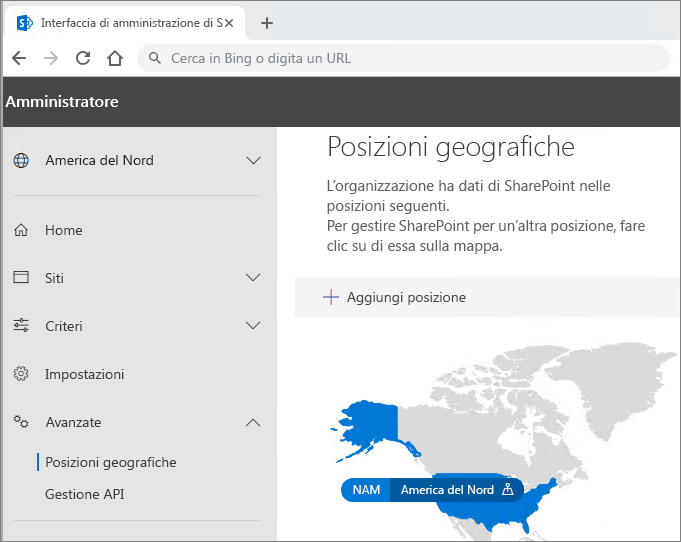

# Multi-Geo Capabilities in OneDrive e SharePoint OnlineMulti-Geo Capabilities in OneDrive and SharePoint Online in Office 365

La funzionalità Multi-Geo in OneDrive e SharePoint Online consente di controllare il paese/area geografica in cui sono archiviate le risorse condivise, ad esempio dei team di SharePoint e delle cassette postali di Gruppi di Office 365.Multi-Geo capabilities in OneDrive and SharePoint Online enables control of the country or region where shared resources like SharePoint team sites and Office 365 Group mailboxes are stored at rest.

Ogni utente, ogni cassetta postale di Gruppi e ogni sito SharePoint ha una posizione dei dati preferita che indica la posizione geografica in cui i dati associati vengono archiviati.Each user, Group mailbox, and SharePoint site has a Preferred Data Location (PDL) which denotes the geo location where related data is to be stored. I dati personali degli utenti (cassetta postale di Exchange e OneDrive) insieme ai siti SharePoint o ai gruppi di Office 365 creati, possono essere archiviati nella posizione geografica specificata per soddisfare i requisiti di residenza dei dati.Users' personal data (Exchange mailbox and OneDrive) along with any Office 365 Groups or SharePoint sites that they create can be stored in the specified geo location to meet data residency requirements. È possibile [specificare amministratori diversi per ogni posizione geografica](add-a-sharepoint-geo-admin.md).You can [specify different administrators for each geo location](add-a-sharepoint-geo-admin.md).

In questo modo gli utenti avranno un’esperienza uniforme quando usano i servizi di Office 365, incluse le applicazioni Office, OneDrive e Search.Users get a seamless experience when using Office 365 services, including Office applications, OneDrive, and Search. Per i dettagli vedere [Esperienza utente in un ambiente multi-geografico](multi-geo-user-experience.md).See [User experience in a multi-geo environment](multi-geo-user-experience.md) for details.

## OneDriveOneDrive

Ogni utente di OneDrive può essere gestito o [spostato da un amministratore](move-onedrive-between-geo-locations.md) in una posizione satellite in base alla propria posizione dei dati preferita.Each user's OneDrive can be provisioned in or [moved by an administrator](move-onedrive-between-geo-locations.md) to a satellite location in accordance with the user's PDL. I file personali vengono quindi mantenuti in tale posizione geografica, ma possono essere condivisi con utenti di altre posizioni geografiche.Personal files are then kept in that geo location, though they can be shared with users in other geo locations.

## Utenti e gruppiActive Directory Sites and Routing Groups tab

Quando un utente crea un sito connesso a un gruppo di SharePoint, la posizione dei dati preferita viene usata per determinare la posizione geografica in cui viene creato il sito e la relativa cassetta postale di Gruppi.When a user creates a SharePoint group-connected site, their PDL is used to determine the geo location where the site and its associated Group mailbox is created. Se la posizione dei dati preferita dell'utente non è stata impostata o è stata impostata una posizione geografica non configurata come satellite, il sito e la cassetta postale vengono creati nella posizione centrale.(If the user's PDL value hasn't been set, or has been set to geo location that hasn't been configured as a satellite location, then the site and mailbox are created in the central location.)

Solo i servizi Exchange, OneDrive e SharePoint di Office 365 dispongono della funzionalità Multi-Geo.Office 365 services other than Exchange, OneDrive, and SharePoint are not Multi-Geo. Tuttavia, i gruppi di Office 365 creati con questi servizi riportano la posizione dei dati preferita dell'autore e le cassette postali dei gruppi di Exchange e il sito SharePoint dei Gruppi di O365 verranno forniti nella posizione geografica corrispondente.However, Office 365 Groups that are created by these services will be stamped with the PDL of the creator and their Exchange Group mailbox and SharePoint O365 Group Site provisioned in the corresponding geo. 

## Gestione dell'ambiente multi-geograficoManaging the multi-geo environment

La configurazione e la gestione dell'ambiente multi-geo vengono eseguite tramite l'interfaccia di amministrazione di SharePoint.Setting up and managing your multi-geo environment is done through the SharePoint admin center. 

Per alcune azioni, come il trasferimento di un sito di SharePoint o OneDrive, è necessario Microsoft PowerShell.(Some actions, such as moving a SharePoint site or a OneDrive site require Microsoft PowerShell.)

## Vedere ancheSee also

[Aka.ms/GetMultiGeo Aka.ms/GetMultiGeo ](https://Aka.ms/GetMultiGeo)

[Amministrare un ambiente multi-geoAdministering a multi-geo environment](administering-a-multi-geo-environment.md)

[Quote di archiviazione di SharePoint in ambienti multi-geo SharePoint storage quotas in multi-geo environments](sharepoint-multi-geo-storage-quota.md)

[Amministrazione delle cassette postali di Exchange Online in un ambiente multi-geoAdministering Exchange Online mailboxes in a multi-geo environment](administering-exchange-online-multi-geo.md)
