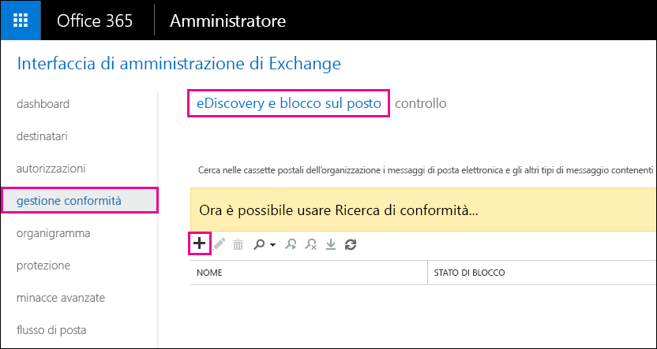
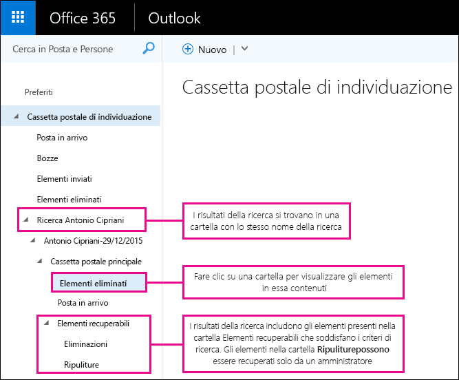
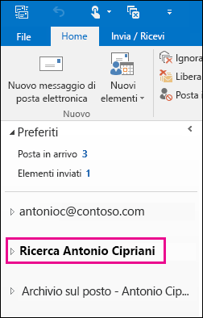
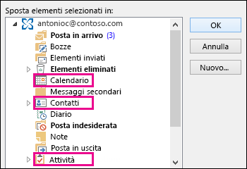

# Ripristinare gli elementi eliminati in una cassetta postale utente - Guida per l'amministratore

**Questo articolo è rivolto agli amministratori. Si sta tentando di recuperare gli elementi eliminati nella propria cassetta postale? ** Eseguire una delle seguenti operazioni:
- [Recuperare gli elementi eliminati in Outlook per Windows](https://support.office.com/article/49e81f3c-c8f4-4426-a0b9-c0fd751d48ce)
- [Recuperare elementi o messaggi di posta elettronica eliminati in Outlook Web App](https://support.office.com/article/c3d8fc15-eeef-4f1c-81df-e27964b7edd4)
- [Ripristinare i messaggi di posta elettronica eliminati in Outlook sul Web](https://support.office.com/article/a8ca78ac-4721-4066-95dd-571842e9fb11)
- [Outlook.com](https://go.microsoft.com/fwlink/p/?LinkID=623435)
   
Può accadere che un utente elimini in modo permanente alcuni elementi della propria cassetta postale di Outlook e che voglia recuperarli senza riuscirci. È possibile recuperare gli elementi eliminati se non sono stati rimossi definitivamente dalla cassetta postale dell'utente. Per eseguire questa operazione, usare lo strumento eDiscovery sul posto di Exchange Online per cercare i messaggi e altri elementi eliminati, ad esempio i contatti, gli appuntamenti del calendario e le attività, dalla cassetta postale di un utente. Se si trovano gli elementi eliminati, è possibile esportarli in un file PST, o file di dati di Outlook, che l'utente può poi usare per ripristinare gli elementi nella cassetta postale.
  
Ecco i passaggi per ripristinare gli elementi eliminati nella cassetta postale di un utente. Quanto tempo è necessario? La prima volta può richiedere da 20 a 30 minuti per il completamento di tutti i passaggi, a seconda del numero di elementi che si vuole recuperare.
  
> [!NOTE]
> È necessario essere un **amministratore di Exchange** o un **amministratore globale** in Microsoft 365 o essere un membro del gruppo di ruoli Gestione organizzazione in Exchange Online per eseguire la procedura descritta in questo articolo. Per altre informazioni, vedere [Informazioni sui ruoli di amministratore di Microsoft 365](https://support.office.com/article/da585eea-f576-4f55-a1e0-87090b6aaa9d). 
  
## Passaggio 1: Assegnare a se stessi le autorizzazioni di eDiscovery

Il primo passaggio consiste nell'assegnare a se stessi le autorizzazioni necessarie di Exchange Online per poter usare lo strumento eDiscovery sul posto per eseguire ricerche nella cassetta postale di un utente. Questa procedura deve essere eseguita una sola volta. Se sarà necessario eseguire una ricerca in un'altra cassetta postale in futuro, è possibile ignorare questo passaggio.
  
1. [Dove accedere a Microsoft 365 for business](https://support.microsoft.com/office/where-to-sign-into-microsoft-365-for-business-e9eb7d51-5430-4929-91ab-6157c5a050b4) con il proprio account aziendale o dell'Istituto di istruzione. 
    
2. Selezionare l'icona di avvio  nell'angolo in alto a sinistra e fare clic su **amministratore**.
    
3. Nel riquadro di spostamento a sinistra nell'interfaccia di amministrazione di Microsoft 365, espandere **Interfaccia di amministrazione** e poi fare clic su **Exchange**.
    
    
  
4. Nell’Interfaccia di amministrazione fare clic su **Autorizzazioni** e poi su **Ruoli amministratore**.
    
5. In questo elenco, selezionare **Gestione individuazione**, poi fare clic su **Modifica**.
    
    
  
6. In **Gruppi di ruoli**, sotto **Membri**, fare clic su **Aggiungi**.
    
7. In **Scegli i membri**, selezionare il proprio nome nell'elenco, fare clic su **Aggiungi** e poi su **OK**.
    
    > [!NOTE]
    > È anche possibile aggiungere un gruppo di cui si è un membro, ad esempio il gruppo di gestione dell'organizzazione o degli amministratori del tenant. Se si aggiunge un gruppo, agli altri membri del gruppo vengono assegnate le autorizzazioni necessarie per eseguire lo strumento eDiscovery sul posto. 
  
8. In **Gruppo di ruoli**, fare clic su **Salva**.
    
9. Disconnettersi da Microsoft 365.
    
    È necessario disconnettersi prima di iniziare il passaggio successivo, in modo da rendere effettive le nuove autorizzazioni.
    
> [!CAUTION]
> I membri del gruppo di ruoli Gestione individuazione possono accedere al contenuto dei messaggi riservati. Sono incluse le ricerche in tutte le cassette postali dell'organizzazione, la visualizzazione in anteprima dei risultati della ricerca, e di altri elementi della cassetta postale, la copia dei risultati in una cassetta postale di individuazione e l’esportazione dei risultati della ricerca in un file PST. 
  
[Inizio pagina](recover-deleted-items-in-a-mailbox.md)
  
## Passaggio 2: Cercare gli elementi eliminati nella cassetta postale dell'utente

Quando si esegue una ricerca eDiscovery sul posto, la cartella Elementi ripristinabili nella cassetta postale in cui si sta eseguendo la ricerca viene automaticamente inclusa nella ricerca. La cartella Elementi ripristinabili è il luogo dove vengono archiviati gli elementi eliminati fino a quando non vengono rimossi per sempre dalla cassetta postale. Pertanto, se un elemento non è stato rimosso, è possibile trovarlo con lo strumento eDiscovery sul posto.
  
1. [Dove accedere a Microsoft 365 for business](https://support.microsoft.com/office/where-to-sign-into-microsoft-365-for-business-e9eb7d51-5430-4929-91ab-6157c5a050b4) con il proprio account aziendale o dell'Istituto di istruzione. 
    
2. Selezionare l'icona di avvio  nell'angolo in alto a sinistra e fare clic su **amministratore**.
    
3. Nel riquadro di spostamento a sinistra nell'interfaccia di amministrazione di Office 365, espandere **Amministratore** e poi fare clic su **Exchange**.
    
4. Nell'interfaccia di amministrazione di Exchange fare clic su **Gestione conformità**, poi su **eDiscovery &amp;blocco sul posto**e infine fare clic sull’icona **Nuovo**.
    
    
  
5. Nella pagina **Nome e descrizione** digitare un nome per la ricerca, ad esempio il nome dell'utente per cui si sta ripristinando la posta elettronica, una descrizione facoltativa e poi fare clic su **Avanti**.
    
6. Nella pagina **Cassette postali** fare clic su **Specifica le cassette postali in cui cercare** e quindi fare clic su **Aggiungi**.
    
    
  
7. Trovare e selezionare il nome dell'utente per cui si ripristinano i messaggi di posta elettronica eliminati, fare clic su **Aggiungi** e dopo su **OK**.
    
8. Fare clic su **Avanti**.
    
    Viene visualizzata la pagina **Query di ricerca**. In questa posizione si definiscono i criteri di ricerca che consentono di trovare gli elementi mancanti nella cassetta postale dell'utente. 
    
9. Nella pagina **Query di ricerca** compilare i seguenti campi: 
    
  - **Includi tutto il contenuto** Selezionare questa opzione per includere tutto il contenuto della cassetta postale dell'utente nei risultati della ricerca. Se viene selezionata questa opzione, non è possibile specificare ulteriori criteri di ricerca. 
    
  - **Filtra sulla base dei criteri** Selezionare questa opzione per specificare i criteri di ricerca, incluse le parole chiave, le date di inizio e di fine, gli indirizzi del mittente e del destinatario e i tipi di messaggio. 
    
    
  
|**Campo**|**Utilizzare questa opzione per...**|
|:-----|:-----|
|             |Specificare le parole chiave, un intervallo di date, i destinatari e i tipi di messaggi.    |
|             |Cercare i messaggi con parole chiave o frasi e usare gli operatori logici, ad esempio **AND** oppure **OR**.    |
|             |Cercare i messaggi inviati o ricevuti in un intervallo di date.    |
|             |Cercare i messaggi ricevuti o inviati a utenti specifici.    |
|             |Cercare tutti i tipi di messaggi oppure selezionarne di specifici.    |
   
   > [!TIP]
   >  Ecco alcuni suggerimenti su come creare una query di ricerca per trovare gli elementi mancanti. Provare a ottenere dall'utente tutte le informazioni necessarie per creare una query di ricerca idonea per trovare gli elementi cercati. Se non si è sicuri di come trovare un messaggio mancante, è consigliabile usare l'opzione **Includi tutto il contenuto**. I risultati della ricerca includeranno tutti gli elementi nella cartella Elementi ripristinabili dell'utente, tra cui la cartella nascosta (denominata Ripuliture) che contiene gli elementi che sono stati eliminati dall'utente. A questo punto è possibile passare al passaggio 3, copiare i risultati in una cassetta postale di individuazione e osservare il messaggio nella cartella nascosta. Se si conosce approssimativamente quando il messaggio mancante è stato inviato o ricevuto dall'utente originariamente, usare le opzioni **Specifica la data di inizio** e **Specifica la data di fine** per specificare un intervallo di date. Verranno restituiti tutti i messaggi inviati o ricevuti dall'utente in tale intervallo di date. Specificare un intervallo di date è un modo molto efficace per limitare i risultati della ricerca. Se si conosce chi ha inviato i messaggi mancanti, usare la casella **Da** per specificare il mittente. Se si vuole limitare i risultati della ricerca a tipi diversi di elementi della cassetta postale, fare clic su **Seleziona tipi di messaggi**, quindi su **Scegli i tipi di messaggi in cui cercare** e infine scegliere un tipo di messaggio specifico da cercare. È ad esempio possibile cercare solo gli elementi del calendario o i contatti. Ecco una schermata che illustra i diversi tipi di messaggio che è possibile cercare. Per impostazione predefinita vengono cercati tutti i tipi di messaggio. 
  
   Fare clic su **Avanti** dopo aver completato la pagina **Query di ricerca**. 
    
10. Nella pagina **Impostazioni di blocco sul posto** fare clic su **Fine** per avviare la ricerca. Per recuperare i messaggi eliminati, non occorre impostare un blocco per la cassetta postale dell'utente. 
    
    Dopo aver iniziato la ricerca, Exchange visualizzerà una stima delle dimensioni totali e del numero di elementi restituiti dalla ricerca in base ai criteri specificati.
    
11. Selezionare la ricerca appena creata e fare clic su **Aggiorna** per aggiornare le informazioni visualizzate nel riquadro dei dettagli. Lo stato di **Stima completata** indica che la ricerca è terminata. Exchange visualizza anche una stima del numero totale di elementi, e delle relative dimensioni, trovati mediante la ricerca in base ai criteri di ricerca specificati nel passaggio 9. 
    
12. Nel riquadro dei dettagli, fare clic su **Anteprima risultati della ricerca** per visualizzare gli elementi che sono stati individuati. Questo potrebbe aiutare a identificare gli elementi che si stanno cercando. Se si trovano gli elementi che si vogliono recuperare, andare al passaggio 4 per esportare i risultati della ricerca in un file PST. 
    
    
  
13. Se non si trova ciò che sta cercando, è possibile modificare i criteri di ricerca facendo clic sull’icona **Modifica** e poi su **Query di ricerca**. Modificare i criteri di ricerca e quindi eseguire di nuovo la ricerca.
    
[Inizio pagina](recover-deleted-items-in-a-mailbox.md)
  
## (Facoltativo) Passaggio 3: Copiare i risultati della ricerca in una cassetta postale di individuazione

Se non si riesce a trovare un elemento nell’anteprima dei risultati della ricerca o se si vuole vedere quali elementi sono presenti nella cartella Elementi ripristinabili, è possibile copiare i risultati della ricerca in una cassetta postale speciale denominata cassetta postale di individuazione e quindi aprirla in Outlook sul Web per visualizzare gli elementi effettivi. La copia dei risultati della ricerca rappresenta il modo migliore di visualizzare gli elementi nella cartella Elementi ripristinabili dell'utente. È molto probabile che l'elemento che si vuole recuperare si trovi nella sottocartella Ripuliture. 
  
1. Nell'interfaccia di amministrazione di Exchange passare a **Gestione conformità**\>**eDiscovery &amp; blocco sul posto**.
    
2. Nell'elenco delle ricerche selezionare la ricerca creata nel passaggio 2.
    
3. Fare clic su** Ricerca**, poi su **Copia risultati della ricerca** dall'elenco a discesa. 
    
    
  
4. Nella pagina **Copia risultati della ricerca** fare clic su **Sfoglia**.
    
    
  
5. In **Nome visualizzato** fare clic su **Cassetta postale di individuazione** e quindi su **OK**.
    
    
  
    > [!NOTE]
    > La cassetta postale di ricerca di individuazione è una cassetta postale di individuazione predefinita creata automaticamente nell'organizzazione Microsoft 365. 
  
6. Tornare alla pagina **Copia risultati della ricerca**, fare clic su **Copia** per avviare la copia dei risultati della ricerca nella assetta postale di individuazione. 
    
    
  
7. Fare clic su **Aggiorna** per aggiornare le informazioni sullo stato della copia visualizzate nel riquadro dei dettagli. 
    
8. Al termine della copia, fare clic su **Apri** per aprire la cassetta postale di individuazione e visualizzare i risultati della ricerca. 
    
    
  
    I risultati della ricerca copiati nella cassetta postale di individuazione vengono inseriti in una cartella con lo stesso nome della ricerca eDiscovery sul posto. È possibile fare clic su una cartella per visualizzare gli elementi presenti.
    
    
  
    Quando si esegue una ricerca, la ricerca viene effettuata anche nella cartella Elementi ripristinabili dell'utente. Pertanto, se gli elementi nella cartella Elementi ripristinabili soddisfano i criteri di ricerca, vengono inclusi nei risultati della ricerca. Gli elementi nella cartella Eliminazioni sono gli elementi eliminati in modo permanente dall'utente: gli elementi eliminati dalla cartella Posta eliminata oppure gli elementi selezionati con successiva esecuzione di **MAIUC+CANC**. Un utente può usare lo strumento Recupera Posta eliminata in Outlook o Outlook sul Web per recuperare gli elementi nella cartella Eliminazioni. Gli elementi nella cartella Ripuliture sono elementi che l'utente ha eliminato tramite lo strumento Recupera elementi eliminati o eliminati automaticamente dai criteri applicati alla cassetta postale. In entrambi i casi, solo un amministratore può recuperare gli elementi nella cartella Ripuliture. 
    
    > [!TIP]
    > Se un utente non riesce a trovare un elemento eliminato tramite lo strumento Elementi ripristinabili, ma tale elemento è comunque ripristinabile, in quanto non è stato rimosso definitivamente dalla cassetta postale, è molto probabile che si trovi nella cartella Purges. Pertanto, assicurarsi di controllare la cartella Ripuliture per cercare gli elementi eliminati che si vuole recuperare per un utente. 
  
[Inizio pagina](recover-deleted-items-in-a-mailbox.md)
  
## Passaggio 4: Esportare i risultati della ricerca in un file PST

Dopo aver individuato l'elemento che si vuole recuperare per un utente, occorre esportare i risultati della ricerca eseguita al passaggio 2 in un file PST. L'utente userà questo file PST nel passaggio successivo per ripristinare l'elemento eliminato nella propria cassetta postale.
  
1. Nell'interfaccia di amministrazione di Exchange passare a **Gestione conformità**\>**eDiscovery &amp; blocco sul posto**.
    
2. Nell'elenco delle ricerche selezionare la ricerca creata nel passaggio 2.
    
3. Fare clic su **Esporta in un file PST**.
    
    
  
4. Se viene richiesto di installare lo strumento di esportazione di eDiscovery, fare clic su **Esegui**.
    
5. Nello strumento di esportazione PST eDiscovery fare clic su **Sfoglia** per specificare il percorso in cui si vuole scaricare il file PST. 
    
    
  
    È possibile ignorare le opzioni per abilitare la deduplicazione e includere elementi non ricercabili.
    
6. Fare clic su **Start** per scaricare il file PST nel computer. 
    
    Lo **strumento di esportazione di eDiscovery** mostra le informazioni relative all stato del processo di esportazione. Quando l'esportazione è completa, è possibile accedere al file nella posizione in cui è stato scaricato. 
    
[Inizio pagina](recover-deleted-items-in-a-mailbox.md)
  
## Passaggio 5: Ripristinare gli elementi recuperati nella cassetta postale dell'utente

Il passaggio finale consiste nell'usare il file PST esportato nel passaggio 4 per ripristinare gli elementi recuperati nella cassetta postale dell'utente. Dopo l'invio del file PST, l'utente esegue la parte restante di questo passaggio per aprire il file PST e quindi spostare gli elementi recuperati in un'altra cartella nella propria cassetta postale. Per istruzioni dettagliate, è anche possibile inviare all'utente un collegamento a questo argomento: [Aprire e chiudere file di dati di Outlook (PST)](https://support.office.com/article/381b776d-7511-45a0-953a-0935c79d24f2). In alternativa, è possibile inviare all'utente un collegamento alla sezione [Ripristinare gli elementi eliminati in una cassetta postale tramite un file PST](recover-deleted-items-in-a-mailbox.md#restoredeleteditems) e chiedergli di eseguire questa procedura. 
  
 **Inviare il file PST all'utente**
  
Il passaggio finale che è necessario eseguire è inviare all'utente il file PST esportato al passaggio 4. Questa operazione si può eseguire in vari modi:
  
- Allegare il file PST a un messaggio di posta elettronica. Se Outlook è configurato per bloccare i file PST, sarà necessario comprimere il file e quindi allegarlo al messaggio. Ecco come:
    
1. In Windows Explorer o File Explorer passare al file PST.
    
2. Fare clic con il pulsante destro del mouse sul file, quindi selezionare **Invia a** \> **Cartella compressa**. Windows crea un nuovo file ZIP a cui assegna lo stesso nome del file PST.
    
3. Allegare il file PST compresso a un messaggio di posta elettronica e inviarlo all'utente, che potrà poi decomprimere il file semplicemente facendo clic su di esso.
    
- Copiare il file PST in una cartella condivisa a cui l'utente potrà accedere per recuperarlo.
    
La procedura descritta nella sezione seguente viene eseguita dall'utente per ripristinare gli elementi eliminati nella propria cassetta postale.
  
 
**Ripristinare gli elementi eliminati in una cassetta postale tramite un file PST**
  
Per ripristinare un elemento eliminato tramite un file PST, è necessario usare l'app desktop di Outlook. Non è possibile usare Outlook Web App o Outlook sul Web per aprire un file PST.
  
1. In Outlook 2013 o Outlook 2016 fare clic sulla scheda **File**. 
    
2. Fare clic su **Apri &amp; esporta** e quindi su **Apri file di dati di Outlook**.
    
3. Passare al percorso in cui è stato salvato il file PST inviato dall'amministratore.
    
4. Selezionare il file PST e poi fare clic su **Apri**.
    
    Il file PST viene visualizzato nella barra di spostamento sinistra di Outlook.
    
    
  
5. Fare clic sulle frecce per espandere il file PST e le cartelle secondarie per individuare l'elemento da recuperare.
    
    
  
    > [!TIP]
    > Cercare l'elemento da recuperare nella cartella Ripuliture. Si tratta di una cartella nascosta in cui vengono spostati gli elementi eliminati. È probabile che l'elemento recuperato dall'amministratore sia in questa cartella. 
  
6. Fare clic con il pulsante destro del mouse sull'elemento da recuperare e poi fare clic su **Sposta** \> **Altra cartella**.
    
    
  
7. Per spostare l'elemento nella cartella Posta in arrivo, fare clic su **Posta in arrivo** e poi su **OK**.
    
    **Suggerimento:** Per recuperare altri tipi di elementi, eseguire una delle operazioni seguenti: 
    
  - Per recuperare un elemento del calendario, fare clic su di esso con il pulsante destro del mouse e scegliere **Sposta** \> **Altra cartella** \> **Calendario**.
    
  - Per recuperare un contatto, fare clic su di esso con il pulsante destro del mouse e scegliere **Sposta** \> **Altra cartella** \> ** Contatti**.
    
  - Per recuperare un'attività, fare clic su di essa con il pulsante destro del mouse e scegliere **Sposta** \> **Altra cartella** \> **Attività**.
    

  
   > [!NOTE]
   > Gli elementi del calendario, i contatti e le attività si trovano direttamente nella cartella Ripuliture e non in una sottocartella del calendario, dei contatti o delle attività. È possibile tuttavia ordinare per **tipo** per raggruppare i tipi di elementi simili. 
    
8. Dopo aver completato il recupero degli elementi eliminati, fare clic con il pulsante destro del mouse sul file PST nella barra di spostamento sinistra e selezionare **Chiudi "nome del file PST"**.
    
[Inizio pagina](recover-deleted-items-in-a-mailbox.md)
  
## Altre informazioni

- Un utente può recuperare un elemento eliminato definitivamente, se il periodo di conservazione degli elementi eliminati non è scaduto. È possibile che l'amministratore abbia specificato per quanto tempo sono disponibili gli elementi nella cartella Elementi ripristinabili. Ad esempio, possono essere stati configurati dei criteri in base ai quali tutti gli elementi contenuti nella cartella Posta eliminata vengono eliminati dopo 30 giorni e altri criteri che consentono di recuperare gli elementi nella cartella Elementi ripristinabili per altri 14 giorni. Tuttavia, dopo 14 giorni, è ancora possibile recuperare un elemento della cassetta postale di un utente tramite le procedure descritte in questo argomento.
    
- Gli utenti possono ripristinare un elemento se non è stato rimosso e se non è scaduto il periodo di conservazione per quell'elemento. Per aiutare gli utenti a recuperare gli elementi eliminati nella propria cassetta postale, suggerire loro di consultare gli argomenti seguenti:
    
  - [Ripristinare gli elementi eliminati in Outlook per Windows](https://support.office.com/article/49e81f3c-c8f4-4426-a0b9-c0fd751d48ce)
    
  - [Ripristinare gli elementi eliminati in Outlook 2010](https://support.office.com/article/cd9dfe12-8e8c-4a21-bbbf-4bd103a3f1fe)
    
  - [Recuperare elementi o messaggi di posta elettronica eliminati in Outlook Web App](https://support.office.com/article/c3d8fc15-eeef-4f1c-81df-e27964b7edd4)
    
  - [Ripristinare i messaggi di posta elettronica eliminati in Outlook sul Web](https://support.office.com/article/a8ca78ac-4721-4066-95dd-571842e9fb11)
    
  - [Recuperare un contatto eliminato in Outlook](https://support.office.com/article/51c83288-6888-4dcd-8c99-4932daabf643)
    
  - [Ripristinare i messaggi di posta elettronica eliminati in Outlook.com](https://go.microsoft.com/fwlink/p/?LinkID=623435)
    
[Inizio pagina](recover-deleted-items-in-a-mailbox.md)
  

