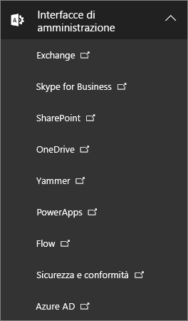
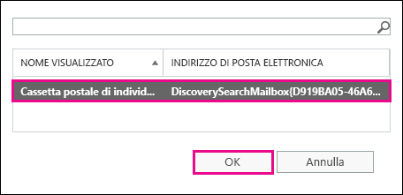
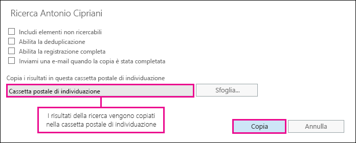
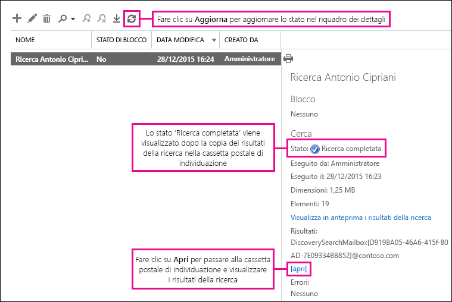
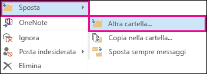

# Recuperare elementi eliminati in una cassetta postale utente - Guida per l'amministratore

**Questo articolo è per gli amministratori. Si sta tentando di recuperare gli elementi eliminati nella propria cassetta postale?** Provare a eseguire una delle operazioni seguenti:
- [Recuperare gli elementi eliminati in Outlook per Windows](https://support.office.com/article/49e81f3c-c8f4-4426-a0b9-c0fd751d48ce)
- [Recuperare elementi o messaggi di posta elettronica eliminati in Outlook Web App](https://support.office.com/article/c3d8fc15-eeef-4f1c-81df-e27964b7edd4)
- [Ripristinare i messaggi di posta elettronica eliminati in Outlook sul Web](https://support.office.com/article/a8ca78ac-4721-4066-95dd-571842e9fb11)
- [Outlook.com](https://go.microsoft.com/fwlink/p/?LinkID=623435)
   
Un utente ha eliminato definitivamente gli elementi dalla propria cassetta postale di Outlook? L'utente li rivuole indietro ma non è in grado di recuperarli. Potrebbe essere possibile recuperare gli elementi eliminati, se non sono stati rimossi definitivamente dalla cassetta postale dell'utente. A tale scopo, è possibile utilizzare lo strumento eDiscovery sul posto in Exchange Online per cercare messaggi di posta elettronica eliminati e altri elementi, ad esempio contatti, appuntamenti del calendario e attività, nella cassetta postale di un utente. Se si trovano gli elementi eliminati, è possibile esportarli in un file PST (denominato anche file di dati di Outlook), che l'utente può quindi utilizzare per ripristinare gli elementi alla propria cassetta postale.
  
Di seguito sono riportati i passaggi per il ripristino degli elementi eliminati nella cassetta postale di un utente. Quanto tempo richiederà? La prima volta potrebbe richiedere 20 o 30 minuti per completare tutti i passaggi, a seconda del numero di elementi che si sta tentando di recuperare.
  
> [!NOTE]
> È necessario essere un **amministratore di Exchange** o un **amministratore globale** in Office 365 oppure essere membri del gruppo di ruoli Gestione organizzazione in Exchange Online per eseguire la procedura descritta in questo articolo. Per ulteriori informazioni, vedere [Informazioni sui ruoli di amministratore di Office 365](https://support.office.com/article/da585eea-f576-4f55-a1e0-87090b6aaa9d). 
  
## Passaggio 1: assegnare le autorizzazioni di eDiscovery

Il primo passaggio consiste nell'assegnare le autorizzazioni necessarie in Exchange online in modo che sia possibile utilizzare lo strumento eDiscovery sul posto per cercare la cassetta postale di un utente. È necessario eseguire questa operazione una sola volta. Se è necessario eseguire la ricerca in un'altra cassetta postale in futuro, è possibile ignorare questo passaggio.
  
1. [Where to sign in to Office 365 for business](https://support.office.com/article/e9eb7d51-5430-4929-91ab-6157c5a050b4) con l'account aziendale o dell'istituto di istruzione. 
    
2. Selezionare l'icona di avvio  in Office 365 nell'angolo in alto a sinistra e fare clic su **amministratore**.
    
3. Nel riquadro di spostamento sinistro dell'interfaccia di amministrazione di Office 365 espandere interfaccia di **Amministrazione**e quindi fare clic su **Exchange**.
    
    
  
4. Nell'interfaccia di amministrazione di Exchange, fare clic su **autorizzazioni**, quindi fare clic su **ruoli di amministratore**.
    
5. Nella visualizzazione elenco, selezionare **Gestione individuazione**, quindi fare clic su **modifica**modifica.
    
    
  
6. In **gruppo di ruoli**, **in membri**, fare clic su](media/8ee52980-254b-440b-99a2-18d068de62d3.gif) **Aggiungi**![icona Aggiungi.
    
7. In **Seleziona membri**selezionare l'elenco dei nomi, fare clic su **Aggiungi**, quindi fare clic su **OK**.
    
    > [!NOTE]
    > È inoltre possibile aggiungere un gruppo di cui si è membri, ad esempio Gestione organizzazione o TenantAdmins. Se si aggiunge un gruppo, agli altri membri del gruppo verranno assegnate le autorizzazioni necessarie per eseguire lo strumento eDiscovery sul posto. 
  
8. In **gruppo di ruoli**fare clic su **Salva**.
    
9. Disconnettersi da Office 365.
    
    Prima di iniziare il passaggio successivo, è necessario disconnettersi in modo che le nuove autorizzazioni siano effettive.
    
> [!CAUTION]
> I membri del gruppo di ruoli Gestione individuazione possono accedere al contenuto dei messaggi riservati. Questo include la ricerca in tutte le cassette postali dell'organizzazione, l'anteprima dei risultati della ricerca (e altri elementi della cassetta postale), la copia dei risultati in una cassetta postale di individuazione ed esportare i risultati della ricerca in un file PST. 
  
[Return to top](recover-deleted-items-in-a-mailbox.md#__top)
  
## Passaggio 2: ricerca della cassetta postale dell'utente per gli elementi eliminati

Quando si esegue una ricerca eDiscovery sul posto, la cartella elementi ripristinabili nella cassetta postale in cui viene eseguita la ricerca viene automaticamente inclusa nella ricerca. La cartella elementi ripristinabili è la posizione in cui vengono archiviati gli elementi eliminati in modo definitivo fino a quando non vengono eliminati definitivamente dalla cassetta postale. Pertanto, se un elemento non è stato eliminato, è necessario essere in grado di trovarlo utilizzando lo strumento eDiscovery sul posto.
  
1. [Where to sign in to Office 365 for business](https://support.office.com/article/e9eb7d51-5430-4929-91ab-6157c5a050b4) con l'account aziendale o dell'istituto di istruzione. 
    
2. Selezionare l'icona di avvio  in Office 365 nell'angolo in alto a sinistra e fare clic su **amministratore**.
    
3. Nel riquadro di spostamento sinistro dell'interfaccia di amministrazione di Office 365 espandere **Amministrazione**e quindi fare clic su **Exchange**.
    
4. Nell'interfaccia di amministrazione di Exchange, fare clic su **Gestione conformità**, fare clic su ** &amp; eDiscovery in locale**e quindi fare clic](media/8ee52980-254b-440b-99a2-18d068de62d3.gif)su **nuova**
  
5. Nella pagina **nome e descrizione** Digitare un nome per la ricerca (ad esempio il nome dell'utente per il quale si sta recuperando la posta elettronica), una descrizione facoltativa e quindi fare clic su **Avanti**.
    
6. Nella pagina **cassette postali** , fare clic su **specificare le cassette postali da cercare**,](media/8ee52980-254b-440b-99a2-18d068de62d3.gif)quindi fare clic su **Aggiungi**
  
7. Individuare e selezionare il nome dell'utente per il quale si sta ripristinando il messaggio di posta elettronica eliminato, fare clic su **Aggiungi**e quindi su **OK**.
    
8. Fare clic su **Avanti**.
    
    Viene visualizzata la pagina **query di ricerca** . In questo modo vengono definiti i criteri di ricerca che consentono di trovare gli elementi mancanti nella cassetta postale dell'utente. 
    
9. Nella pagina **Query di ricerca** compilare i seguenti campi: 
    
  - **Includi tutto il contenuto** Selezionare questa opzione per includere tutto il contenuto nella cassetta postale dell'utente nei risultati della ricerca. Se viene selezionata questa opzione, non è possibile specificare ulteriori criteri di ricerca. 
    
  - **Filtro in base ai criteri** Selezionare questa opzione per specificare i criteri di ricerca, tra cui parole chiave, date di inizio e di fine, indirizzo mittente e destinatario e tipi di messaggi. 
    
    
  
|**Campo**|**Utilizzare questo per...**|
|:-----|:-----|
|             |Specificare parole chiave, intervallo di date, destinatari e tipi di messaggio.    |
|             |Cercare i messaggi con parole chiave o frasi e utilizzare operatori logici quali **and** o **or**.    |
|             |Cercare i messaggi inviati o ricevuti all'interno di un intervallo di date.    |
|             |Consente di cercare i messaggi ricevuti da o inviati a persone specifiche.    |
|             |Cerca tutti i tipi di messaggio o seleziona quelli specifici.    |
   
    > [!TIP]
    >  Here's a few tips about how to build a search query to find missing items. Try to get as much information from the user to help you create a search query so you can find what you're looking for. >  If you not sure how to find a missing message, consider using the **Include all content** option. The search results will include all items in the user's Recoverable Items folder, including the hidden folder (called the Purges folder) that contain items that have been purged by the user. Then you can go to Step 3, copy the results to a discovery mailbox, and look at the message in the hidden folder. >  If you know approximately when the missing message was originally sent or received by the user, use the **Specify start date** and **Specify end date** options to provide a date range. This will return all messages sent or received by the user within that date range. Specifying a date range is a really good way to narrow the search results. >  If you know who sent the missing email, use the **From** box to specify this sender. >  If you want to narrow the search results to different types of mailbox items, click **Select message types**, click **Select the message types to search**, and then choose a specific message type to search for. For example, you can search only for calendar items or contacts. Here's a screenshot of the different message types you can search for; the default is to search for all message types. 
  
    Click **Next** when you've completed the **Search query** page. 
    
10. Nella pagina **Impostazioni blocco sul posto** , fare clic su **fine** per avviare la ricerca. Per recuperare il messaggio di posta elettronica eliminato, non c'è motivo di inserire la cassetta postale dell'utente in attesa. 
    
    Dopo aver avviato la ricerca, Exchange visualizzerà una stima delle dimensioni totali e del numero di elementi che verranno restituiti dalla ricerca in base ai criteri specificati.
    
11. Selezionare la ricerca appena creata e fare clic **** aggiornamento per aggiornare le informazioni visualizzate nel riquadro dei dettagli. Lo stato della **stima ha esito positivo** indica che la ricerca è stata completata. Exchange visualizza anche una stima del numero totale di elementi (e delle relative dimensioni) trovati dalla ricerca in base ai criteri di ricerca specificati nel passaggio 9. 
    
12. Nel riquadro dei dettagli, fare clic su **Anteprima risultati della ricerca** per visualizzare gli elementi che sono stati trovati. Questo potrebbe essere utile per identificare gli elementi che si stanno cercando. Se si trova l'elemento o gli elementi che si sta tentando di ripristinare, passare al passaggio 4 per esportare i risultati della ricerca in un file PST. 
    
    
  
13. Se non si trova ciò che si sta cercando, è possibile modificare i criteri di ricerca selezionando la ricerca, facendo ****icona modifica e quindi su **query di ricerca**. Modificare i criteri di ricerca e quindi eseguire nuovamente la ricerca.
    
[Return to top](recover-deleted-items-in-a-mailbox.md#__top)
  
## Optional Passaggio 3: copiare i risultati della ricerca in una cassetta postale di individuazione

Se non è possibile trovare elementi visualizzando in anteprima i risultati della ricerca o se si desidera visualizzare gli elementi nella cartella elementi ripristinabili dell'utente, è possibile copiare i risultati della ricerca in una cassetta postale speciale (denominata cassetta postale di individuazione) e quindi aprire tale cassetta postale in Outlook sul Web t o visualizzare gli elementi effettivi. Il motivo migliore per copiare i risultati della ricerca è che è possibile visualizzare gli elementi nella cartella elementi ripristinabili dell'utente. Più che probabile, l'elemento che si sta tentando di eseguire il ripristino si trova nella sottocartella Purges. 
  
1. Nell'interfaccia di amministrazione di Exchange, accedere a **gestione** \> **della conformità sul posto &amp; eDiscovery Hold**.
    
2. Nell'elenco delle ricerche, selezionare la ricerca creata al passaggio 2.
    
3. Fare clic su ricerca e quindi su **Copia risultati della ricerca** dall'elenco a discesa. **** 
    
    
  
4. Nella pagina **copia i risultati della ricerca** fare clic su **Sfoglia**.
    
    
  
5. In **nome visualizzato**, fare clic su **Discovery Search Mailbox**, quindi fare clic su **OK**.
    
    
  
    > [!NOTE]
    > La cassetta postale di ricerca di individuazione è una cassetta postale di individuazione predefinita creata automaticamente nell'organizzazione di Office 365. 
  
6. Tornare alla pagina **copia dei risultati della ricerca** , fare clic su **copia** per avviare il processo per copiare i risultati della ricerca nella cassetta postale di individuazione. 
    
    
  
7. Fare clic su](media/165fb3ad-38a8-4dd9-9e76-296aefd96334.png) aggiorna aggiornamento per aggiornare le informazioni sullo stato della copia visualizzate nel riquadro dei dettagli. ****![ 
    
8. Al termine della copia, fare clic su **Apri** per aprire la cassetta postale di ricerca di individuazione per visualizzare i risultati della ricerca. 
    
    
  
    I risultati della ricerca copiati nella cassetta postale di ricerca di individuazione vengono inseriti in una cartella con lo stesso nome della ricerca eDiscovery sul posto. È possibile fare clic su una cartella per visualizzare gli elementi presenti in tale cartella.
    
    
  
    Quando si esegue una ricerca, viene cercata anche la cartella elementi ripristinabili dell'utente. Questo significa che se gli elementi nella cartella elementi ripristinabili soddisfano i criteri di ricerca, vengono inclusi nei risultati della ricerca. Gli elementi della cartella Deletions sono elementi che l'utente ha eliminato definitivamente (eliminando un elemento dalla cartella Posta eliminata o selezionandolo e premendo **MAIUSC + CANC**. Un utente può utilizzare lo strumento Recupera elementi eliminati in Outlook o Outlook sul Web per recuperare gli elementi nella cartella Deletions. Gli elementi della cartella Purges sono elementi che l'utente ha eliminato utilizzando lo strumento Recupera elementi eliminati o gli elementi che sono stati eliminati automaticamente da un criterio applicato alla cassetta postale. In entrambi i casi, solo un amministratore può recuperare gli elementi nella cartella Purges. 
    
    > [!TIP]
    > Se un utente non riesce a trovare un elemento eliminato utilizzando lo strumento elementi ripristinabili, ma tale elemento è ancora ripristinabile (ovvero non è stato rimosso definitivamente dalla cassetta postale), è più probabile che si trovi nella cartella Purges. Assicurarsi quindi di cercare nella cartella Purges l'elemento eliminato che si sta tentando di recuperare per un utente. 
  
[Return to top](recover-deleted-items-in-a-mailbox.md#__top)
  
## Passaggio 4: esportare i risultati della ricerca in un file PST

Dopo aver individuato l'elemento che si sta tentando di recuperare per un utente, il passaggio successivo consiste nell'esportare i risultati della ricerca eseguita nel passaggio 2 in un file PST. L'utente utilizzerà questo file PST nel passaggio successivo per ripristinare l'elemento eliminato nella propria cassetta postale.
  
1. Nell'interfaccia di amministrazione di Exchange, accedere a **gestione** \> **della conformità sul posto &amp; eDiscovery Hold**.
    
2. Nell'elenco delle ricerche, selezionare la ricerca creata al passaggio 2.
    
3. Fare clic su **Esporta in un file PST**.
    
    
  
4. Se viene richiesto di installare lo strumento di esportazione di eDiscovery, fare clic su **Esegui**.
    
5. Nello strumento di esportazione PST di eDiscovery, fare clic su **Sfoglia** per specificare il percorso in cui si desidera scaricare il file PST. 
    
    
  
    È possibile ignorare le opzioni per abilitare la deduplicazione e includere gli elementi non ricercabili.
    
6. Fare clic sul pulsante **Start** per scaricare il file pst nel computer in uso. 
    
    Lo **strumento di esportazione PST di eDiscovery** Visualizza informazioni sullo stato del processo di esportazione. Al termine dell'esportazione, è possibile accedere al file nel percorso in cui è stato scaricato. 
    
[Return to top](recover-deleted-items-in-a-mailbox.md#__top)
  
## Passaggio 5: ripristinare gli elementi recuperati nella cassetta postale dell'utente

Il passaggio finale consiste nell'utilizzare il file PST che è stato esportato nel passaggio 4 per ripristinare gli elementi recuperati nella cassetta postale dell'utente. Dopo aver inviato il file PST all'utente, il resto di questo passaggio viene eseguito dall'utente per aprire il file PST e quindi spostare gli elementi recuperati in un'altra cartella nella propria cassetta postale. Per istruzioni dettagliate, è anche possibile inviare all'utente un collegamento a questo argomento: [aprire e chiudere i file di dati di Outlook (con estensione pst)](https://support.office.com/article/381b776d-7511-45a0-953a-0935c79d24f2). In alternativa, è possibile inviare all'utente un collegamento al [ripristino degli elementi eliminati in una cassetta postale utilizzando una sezione file PST](recover-deleted-items-in-a-mailbox.md#restoredeleteditems) seguente e chiedere loro di eseguire questa procedura. 
  
 **Inviare il file PST all'utente**
  
Il passaggio finale che è necessario eseguire è inviare il file PST che è stato esportato nel passaggio 4 all'utente. Per eseguire questa operazione, è possibile effettuare le seguenti operazioni:
  
- Collegare il file PST a un messaggio di posta elettronica. Se Outlook è configurato per bloccare i file PST, sarà necessario eseguire il zip del file e quindi collegarlo al messaggio. Ecco come:
    
1. In Esplora risorse o Esplora file passare al file PST.
    
2. Fare clic con il pulsante destro del mouse sul file e quindi selezionare **Invia a** \> **compresso (zippato) cartella**. Windows crea un nuovo file zip e gli assegna un nome identico a quello del file PST.
    
3. Collegare il file PST compresso a un messaggio di posta elettronica e inviarlo all'utente, che può quindi decomprimere il file semplicemente facendo clic su di esso.
    
- Copiare il file PST in una cartella condivisa a cui l'utente può accedere e recuperarla.
    
I passaggi nella sezione successiva vengono eseguiti dall'utente per ripristinare gli elementi eliminati alla propria cassetta postale.
  
 
**Ripristinare gli elementi eliminati in una cassetta postale utilizzando un file PST**
  
È necessario utilizzare l'app desktop Outlook per ripristinare un elemento eliminato utilizzando un file PST. Non è possibile utilizzare Outlook Web App o Outlook sul Web per aprire un file PST.
  
1. In Outlook 2013 o Outlook 2016 fare clic sulla scheda **file** . 
    
2. Fare clic su ** &amp; Apri esportazione**e quindi su **Apri file di dati di Outlook**.
    
3. Passare al percorso in cui è stato salvato il file PST inviato dall'amministratore.
    
4. Selezionare il file PST e quindi fare clic su **Apri**.
    
    Il file PST viene visualizzato nella barra di spostamento a sinistra di Outlook.
    
    
  
5. Fare clic sulle frecce per espandere il file PST e le cartelle sotto di esso per individuare l'elemento che si desidera ripristinare.
    
    
  
    > [!TIP]
    > Cercare nella cartella Purges l'elemento che si desidera ripristinare. Si tratta di una cartella nascosta in cui vengono spostati gli elementi eliminati. È probabile che l'elemento recuperato dall'amministratore sia presente in questa cartella. 
  
6. Fare clic con il pulsante destro del mouse sull'elemento che si desidera ripristinare e quindi scegliere **Sposta** \> **altra cartella**.
    
    
  
7. Per spostare l'elemento nella cartella posta in arrivo, fare clic su **posta in arrivo**e quindi fare clic su **OK**.
    
    **Suggerimento:** Per recuperare altri tipi di elementi, eseguire una delle operazioni seguenti: 
    
  - Per recuperare un elemento del calendario, fare clic con il pulsante destro del mouse su di esso e quindi scegliere **Sposta** \> **altro** \> **Calendario**cartella.
    
  - Per recuperare un contatto, fare clic con il pulsante destro del mouse su di esso e quindi scegliere **Sposta** \> **altri** \> **contatti**cartella.
    
  - Per ripristinare un'attività, fare clic con il pulsante destro del mouse su di essa e quindi scegliere **Sposta** \> **altre** \> **attività**cartella.
    

  
    Note that calendar items, contacts, and tasks are located directly in the Purges folder, and not in a Calendar, Contacts, or Tasks subfolder. However, you can sort by **Type** to group similar types of items. 
    
8. Dopo aver ripristinato gli elementi eliminati, fare clic con il pulsante destro del mouse sul file PST nella barra di spostamento a sinistra e selezionare **Chiudi "nome file PST"**.
    
[Return to top](recover-deleted-items-in-a-mailbox.md#__top)
  
## Ulteriori informazioni

- Se il periodo di conservazione degli elementi eliminati per l'elemento non è scaduto, potrebbe essere possibile che un utente recuperi un elemento eliminato definitivamente. Come amministratore, è possibile specificare per quanto tempo gli elementi nella cartella elementi ripristinabili sono disponibili per il ripristino. Ad esempio, potrebbe essere presente un criterio che elimina tutto ciò che è stato nella cartella Posta eliminata di un utente per 30 giorni e un altro criterio che consente agli utenti di recuperare gli elementi nella cartella elementi ripristinabili per un massimo di 14 giorni. Tuttavia, dopo 14 giorni, potrebbe essere comunque possibile recuperare un elemento nella cassetta postale di un utente utilizzando le procedure illustrate in questo argomento.
    
- Gli utenti possono ripristinare un elemento eliminato se non è stato eliminato e se non è scaduto il periodo di conservazione per quell'elemento. Per consentire agli utenti di recuperare gli elementi eliminati nella cassetta postale, indirizzarli a uno dei seguenti argomenti:
    
  - [Recuperare gli elementi eliminati in Outlook per Windows](https://support.office.com/article/49e81f3c-c8f4-4426-a0b9-c0fd751d48ce)
    
  - [Recuperare gli elementi eliminati in Outlook 2010](https://support.office.com/article/cd9dfe12-8e8c-4a21-bbbf-4bd103a3f1fe)
    
  - [Recuperare elementi o messaggi di posta elettronica eliminati in Outlook Web App](https://support.office.com/article/c3d8fc15-eeef-4f1c-81df-e27964b7edd4)
    
  - [Ripristinare i messaggi di posta elettronica eliminati in Outlook sul Web](https://support.office.com/article/a8ca78ac-4721-4066-95dd-571842e9fb11)
    
  - [Recuperare un contatto eliminato in Outlook](https://support.office.com/article/51c83288-6888-4dcd-8c99-4932daabf643)
    
  - [Ripristinare i messaggi di posta elettronica eliminati in Outlook.com](https://go.microsoft.com/fwlink/p/?LinkID=623435)
    
[Torna su](recover-deleted-items-in-a-mailbox.md#__top)
  

