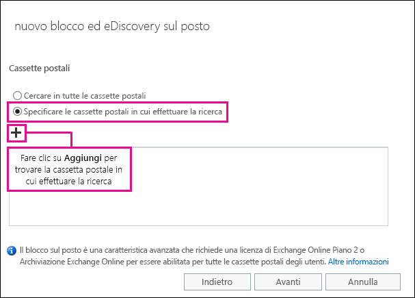
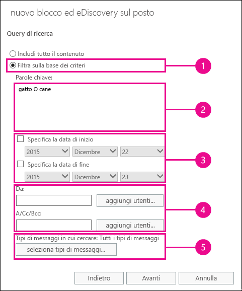
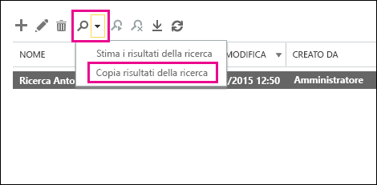
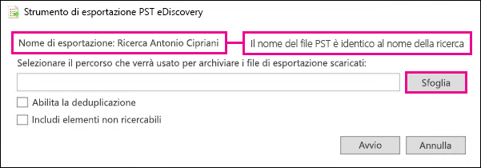

# Recuperare elementi eliminati in una cassetta postale utente - Guida per amministratore

**Questo articolo sia per gli amministratori. Si sta tentando di recuperare elementi eliminati della propria cassetta postale?** Provare a eseguire una delle operazioni seguenti:
- [Recuperare gli elementi eliminati in Outlook per Windows](https://support.office.com/article/49e81f3c-c8f4-4426-a0b9-c0fd751d48ce)
- [Recuperare elementi o messaggi di posta elettronica eliminati in Outlook Web App](https://support.office.com/article/c3d8fc15-eeef-4f1c-81df-e27964b7edd4)
- [Ripristinare i messaggi di posta elettronica eliminati in Outlook sul web](https://support.office.com/article/a8ca78ac-4721-4066-95dd-571842e9fb11)
- [Outlook.com](https://go.microsoft.com/fwlink/p/?LinkID=623435)
   
È stato un utente di eliminare definitivamente gli elementi dalla cassetta postale di Outlook? L'utente desidera li back ma possibile recuperarle. È possibile ripristinare gli elementi eliminati, se non sono stati rimossi definitivamente dalla cassetta postale dell'utente. Ottenere questo risultato mediante lo strumento di eDiscovery In locale in Exchange Online per la ricerca per la posta elettronica eliminato e altri elementi, ovvero e, ad esempio contatti, calendari e attività, nella cassetta postale dell'utente. Se gli elementi eliminati, è possibile esportare in un file PST (denominato anche un File di dati di Outlook), che l'utente può quindi utilizzare per ripristinare gli elementi delle relative cassette postali.
  
Ecco la procedura per ripristinare gli elementi eliminati nella cassetta postale dell'utente. Quanto tempo richiederà l'implementazione? La prima volta può richiedere 20 o 30 minuti di eseguire tutte le procedure, in base al numero di elementi sta tentando di ripristino.
  
> [!NOTE]
> È necessario essere un **amministratore globale** in Office 365 o un **amministratore di Exchange** o essere un membro del gruppo di ruoli Gestione organizzazione in Exchange Online per eseguire i passaggi descritti in questo articolo. Per ulteriori informazioni, vedere [ruoli di amministratore su Office 365](https://support.office.com/article/da585eea-f576-4f55-a1e0-87090b6aaa9d). 
  
## Passaggio 1: Assegnare manualmente le autorizzazioni di eDiscovery

Il primo passaggio consiste nell'assegnare manualmente le autorizzazioni necessarie di Exchange Online in modo che è possibile utilizzare lo strumento di eDiscovery In locale per postale una cassetta di ricerca. È necessario eseguire questa operazione una sola volta. Se si dispone di un'altra cassetta postale di ricerca in futuro, è possibile ignorare questo passaggio.
  
1. [Percorso di accesso a Office 365 per aziende](https://support.office.com/article/e9eb7d51-5430-4929-91ab-6157c5a050b4) con l'account di lavoro o della scuola. 
    
2. Selezionare l'icona di avvio per app  in alto a sinistra e fare clic su **amministratore**.
    
3. Nel riquadro di spostamento sinistro nell'interfaccia di amministrazione di Office 365, espandere **Admin Center**e quindi fare clic su **Exchange**.
    
    
  
4. Nell'interfaccia di amministrazione di Exchange, fare clic su **autorizzazioni**e quindi fare clic su **ruoli amministratore**.
    
5. Nella visualizzazione elenco, selezionare **Gestione individuazione**e quindi fare clic su **Modifica**.
    
    
  
6. Nel **Gruppo di ruoli**, fare clic su **Aggiungi**in **membri**,.
    
7. Nella **Selezione membri**, familiarità selezionare dall'elenco dei nomi, fare clic su **Aggiungi**e quindi fare clic su **OK**.
    
    > [!NOTE]
    > È inoltre possibile aggiungere un gruppo di essere un membro di, ad esempio la gestione dell'organizzazione o TenantAdmins. Se si aggiunge un gruppo, gli altri membri del gruppo riceveranno le autorizzazioni necessarie per eseguire lo strumento di eDiscovery In locale. 
  
8. Nel **Gruppo di ruoli**, fare clic su **Salva**.
    
9. Disconnettersi da Office 365.
    
    È necessario disconnettersi prima di iniziare il passaggio successivo per rendere effettive le nuove autorizzazioni.
    
> [!CAUTION]
> Membri del gruppo di ruoli gestione individuazione possono accedere al contenuto di messaggi sensibili. Sono incluse la ricerca di tutte le cassette postali nell'organizzazione, l'anteprima dei risultati della ricerca (e altri elementi delle cassette postali), copia i risultati di una cassetta postale di individuazione ed esportare i risultati di ricerca in un file PST. 
  
[Inizio pagina](recover-deleted-items-in-a-mailbox.md#__top)
  
## Passaggio 2: Ricerca cassetta postale dell'utente per gli elementi eliminati

Quando si esegue una ricerca eDiscovery In locale, viene incluso automaticamente la cartella elementi ripristinabili nella cassetta postale una ricerca nella ricerca. La cartella elementi ripristinabili è cui gli elementi eliminati in modo permanente vengono archiviati fino a quando non si sta eliminati (rimossa definitivamente) dalla cassetta postale. Pertanto, se non è stato eliminato un elemento, dovrebbe essere in grado di trovare mediante lo strumento di eDiscovery In locale.
  
1. [Percorso di accesso a Office 365 per aziende](https://support.office.com/article/e9eb7d51-5430-4929-91ab-6157c5a050b4) con l'account di lavoro o della scuola. 
    
2. Selezionare l'icona di avvio per app  in alto a sinistra e fare clic su **amministratore**.
    
3. Nel riquadro di spostamento sinistro nell'interfaccia di amministrazione di Office 365, espandere **amministrazione**e quindi fare clic su **Exchange**.
    
4. Nell'interfaccia di amministrazione di Exchange, fare clic su **gestione della conformità**, fare clic su **In-Place eDiscovery &amp; attesa**e quindi fare clic su **Nuovo**.
    
    
  
5. Nella pagina **nome e descrizione** digitare un nome per la ricerca (ad esempio il nome dell'utente ripristino di posta elettronica per), una descrizione facoltativa e quindi fare clic su **Avanti**.
    
6. Nella pagina **cassette postali** , fare clic su **specificare le cassette postali per la ricerca**e quindi fare clic su **Aggiungi**.
    
    
  
7. Trovare e selezionare il nome dell'utente che sta recupero posta eliminata per, fare clic su **Aggiungi**e quindi fare clic su **OK**.
    
8. Fare clic su **Avanti**.
    
    Verrà visualizzata la pagina di **query di ricerca** . In questo campo definire i criteri di ricerca che consentono di individuare gli elementi mancanti nella cassetta postale dell'utente. 
    
9. Nella pagina **Query di ricerca** compilare i seguenti campi: 
    
  - **Includere tutti i contenuti** Selezionare questa opzione per includere tutti i contenuti nella cassetta postale dell'utente nei risultati della ricerca. Se si seleziona questa opzione, è possibile specificare ulteriori criteri di ricerca. 
    
  - **Filtro in base ai criteri** Selezionare questa opzione per specificare i criteri di ricerca, inclusi parole chiave, avviare e terminare le date, mittente e gli indirizzi dei destinatari e i tipi di messaggio. 
    
    
  
|**Campo**|**Utilizzare questa opzione per...**|
|:-----|:-----|
|             |Specificare le parole chiave, intervallo di date, i destinatari e tipi di messaggio.    |
|             |Cercare i messaggi con parole chiave o frasi e utilizzare gli operatori logici, ad esempio **AND** o **OR**.    |
|             |Cercare i messaggi inviati o ricevuti in un intervallo di date.    |
|             |Cercare i messaggi ricevuti o inviati a utenti specifici.    |
|             |Cercare tutti i tipi di messaggi oppure selezionare quelle specifiche.    |
   
    > [!TIP]
    >  Here's a few tips about how to build a search query to find missing items. Try to get as much information from the user to help you create a search query so you can find what you're looking for. >  If you not sure how to find a missing message, consider using the **Include all content** option. The search results will include all items in the user's Recoverable Items folder, including the hidden folder (called the Purges folder) that contain items that have been purged by the user. Then you can go to Step 3, copy the results to a discovery mailbox, and look at the message in the hidden folder. >  If you know approximately when the missing message was originally sent or received by the user, use the **Specify start date** and **Specify end date** options to provide a date range. This will return all messages sent or received by the user within that date range. Specifying a date range is a really good way to narrow the search results. >  If you know who sent the missing email, use the **From** box to specify this sender. >  If you want to narrow the search results to different types of mailbox items, click **Select message types**, click **Select the message types to search**, and then choose a specific message type to search for. For example, you can search only for calendar items or contacts. Here's a screenshot of the different message types you can search for; the default is to search for all message types. 
  
    Click **Next** when you've completed the **Search query** page. 
    
10. Nella pagina **impostazioni di conservazione In locale** , fare clic su **Fine** per avviare la ricerca. Per ripristinare posta eliminata, c'è motivo alla cassetta postale dell'utente di mettere in attesa. 
    
    Dopo aver avviato la ricerca, Exchange verrà visualizzata una stima delle dimensioni totali e numero di elementi che verranno restituiti dalla ricerca in base ai criteri specificati.
    
11. Selezionare la ricerca appena creata e fare clic su **Aggiorna** per aggiornare le informazioni visualizzate nel riquadro dei dettagli. Lo stato della **Stima ha avuto esito positivo** indica che la ricerca sia stata completata. Exchange consente anche di visualizzare una stima del numero totale di elementi (e le dimensioni) trovato mediante la ricerca in base ai criteri di ricerca specificata nel passaggio 9. 
    
12. Nel riquadro dei dettagli fare clic su **Anteprima risultati di ricerca** per visualizzare gli elementi che sono stati trovati. Questo può essere utile identificare gli elementi che si sta cercando. Se gli elementi che si desidera ripristinare, andare al passaggio 4 per esportare i risultati della ricerca in un file PST. 
    
    
  
13. Se non si trova ciò che sta cercando, è possibile modificare i criteri di ricerca, selezionare la ricerca, fare clic su **Modifica**e quindi fare clic su **query di ricerca**. Modificare i criteri di ricerca e quindi eseguire nuovamente la ricerca.
    
[Inizio pagina](recover-deleted-items-in-a-mailbox.md#__top)
  
## (Facoltativo) Passaggio 3: Copiare i risultati della ricerca in una cassetta postale di individuazione

Se non è possibile trovare un elementi dalla visualizzazione in anteprima i risultati della ricerca o se si desidera visualizzare gli elementi che si trovano nella cartella elementi ripristinabili dell'utente, quindi è possibile copiare i risultati della ricerca in una cassetta postale speciale (noti come cassetta postale di individuazione) e quindi aprire tale cassetta postale di Outlook sul web t o visualizzare gli elementi effettivi. Il motivo principale per copiare i risultati di ricerca è pertanto è possibile visualizzare gli elementi nella cartella elementi ripristinabili dell'utente. L'elemento che si desidera recuperare più probabile che si trova nella sottocartella Elimina. 
  
1. Nell'interfaccia di amministrazione di Exchange, andare a **Gestione conformità** \> **In-Place eDiscovery &amp; attesa**.
    
2. Nell'elenco delle ricerche, selezionare la ricerca creata nel passaggio 2.
    
3. Fare clic su **Cerca**, quindi fare clic su **copiare i risultati della ricerca** dall'elenco a discesa. 
    
    
  
4. Nella pagina **Copiare i risultati della ricerca** fare clic su **Sfoglia**.
    
    
  
5. In **Nome visualizzato**, fare clic su **Cassetta postale di individuazione**e quindi fare clic su **OK**.
    
    
  
    > [!NOTE]
    > La cassetta postale di individuazione è una cassetta postale di individuazione predefinita che viene creata automaticamente nella propria organizzazione Office 365. 
  
6. Torna nella pagina **Copiare i risultati della ricerca** fare clic su **Copia** per avviare il processo per copiare i risultati della ricerca per la cassetta postale di individuazione. 
    
    
  
7. Fare clic su **Aggiorna** per aggiornare le informazioni sullo stato copia che viene visualizzata nel riquadro dei dettagli. 
    
8. La copia di un termine, fare clic su **Apri** per aprire la cassetta postale di individuazione per visualizzare i risultati della ricerca. 
    
    
  
    I risultati della ricerca copiati la cassetta postale di individuazione è incluso in una cartella con lo stesso nome di ricerca di eDiscovery In locale. È possibile scegliere una cartella per visualizzare gli elementi presenti nella cartella.
    
    
  
    Quando si esegue una ricerca, anche ricerca nella cartella elementi ripristinabili dell'utente. Ciò significa che se gli elementi nella cartella elementi ripristinabili soddisfano i criteri di ricerca, siano inclusi nei risultati della ricerca. Gli elementi nella cartella eliminazioni sono gli elementi che l'utente eliminato in modo permanente (eliminando un elemento dalla cartella Posta eliminata o selezionandolo e premendo **MAIUSC + CANC**. Un utente può utilizzare lo strumento Recupera elementi eliminati in Outlook o Outlook sul web per ripristinare gli elementi nella cartella eliminazioni. Gli elementi nella cartella Elimina sono gli elementi eliminati tramite lo strumento Recupera posta eliminata dell'utente o gli elementi che sono stati eliminati automaticamente mediante un criterio applicato alla cassetta postale. In entrambi i casi, è possibile solo un amministratore recuperare elementi nella cartella Elimina. 
    
    > [!TIP]
    > Se un utente non riesce a trovare un elemento eliminato utilizzando lo strumento degli elementi recuperabili, ma che l'elemento sia ancora recuperabile, ovvero non è stata rimossa definitivamente dalla cassetta postale, molto probabilmente si trova nella cartella Elimina. Quindi, assicurarsi di cercare nella cartella Elimina per l'elemento eliminato che si sta tentando di ripristino di un utente. 
  
[Inizio pagina](recover-deleted-items-in-a-mailbox.md#__top)
  
## Passaggio 4: Esportare i risultati della ricerca in un file PST

Dopo aver individuato l'elemento che si sta tentando di ripristino di un utente, il passaggio successivo è per esportare i risultati di ricerca che è stato eseguito nel passaggio 2 in un file PST. L'utente verrà utilizzato il file PST nel passaggio successivo per ripristinare elementi eliminati alle cassette postali.
  
1. Nell'interfaccia di amministrazione di Exchange, andare a **Gestione conformità** \> **In-Place eDiscovery &amp; attesa**.
    
2. Nell'elenco delle ricerche, selezionare la ricerca creata nel passaggio 2.
    
3. Fare clic su **Esporta in un file PST**.
    
    
  
4. Se viene richiesto di installare strumento di esportazione di eDiscovery, fare clic su **Esegui**.
    
5. In strumento di esportazione PST di eDiscovery, fare clic su **Sfoglia** per specificare il percorso in cui si desidera scaricare il file PST. 
    
    
  
    È possibile ignorare le opzioni per abilitare deduplication e includere gli elementi non ricercabili.
    
6. Fare clic su **Start** per scaricare il file PST nel computer. 
    
    **EDiscovery dello strumento di esportazione PST** Visualizza le informazioni sullo stato sul processo di esportazione. Al termine dell'esportazione, è possibile accedere il file nel percorso in cui è stato scaricato. 
    
[Inizio pagina](recover-deleted-items-in-a-mailbox.md#__top)
  
## Passaggio 5: Ripristinare gli elementi ripristinati alla cassetta postale dell'utente

Il passaggio finale deve utilizzare il file PST esportato nel passaggio 4 per ripristinare gli elementi ripristinati alla cassetta postale dell'utente. Dopo aver inviato il file PST all'utente, nella parte restante di questo passaggio viene eseguita dall'utente per aprire il file PST e quindi spostare gli elementi recuperati in un'altra cartella nella propria cassetta postale. Per istruzioni dettagliate, si può inoltre inviare all'utente un collegamento in questo argomento: [Open e chiudere il file di dati di Outlook (con estensione pst)](https://support.office.com/article/381b776d-7511-45a0-953a-0935c79d24f2). Oppure è possibile inviare all'utente un collegamento alla sezione [Ripristina posta eliminata in una cassetta postale utilizzando un file PST](recover-deleted-items-in-a-mailbox.md#restoredeleteditems) e chiedere di eseguire la procedura seguente. 
  
 **Inviare il file PST all'utente**
  
Il passaggio finale che è necessario eseguire Invia il file PST esportato nel passaggio 4 per l'utente. Esistono alcuni modi per eseguire questa operazione:
  
- Allegare il file PST a un messaggio di posta elettronica. Se Outlook è configurata per i file di blocco file PST, sarà necessario il file zip e quindi connettersi al messaggio. Ecco come:
    
1. In Esplora risorse o Esplora File, passare al file PST.
    
2. Il file e quindi selezionare **Invia a** \> **Compressed cartella compressa**. Windows consente di creare un nuovo file con estensione zip e gli assegna lo stesso nome del file PST.
    
3. Allegare il file PST compresso a un messaggio di posta elettronica e inviarlo all'utente, che può quindi decomprimere il file appena facendovi.
    
- Copiare il file PST in una cartella condivisa che l'utente può accedere e recupero.
    
I passaggi nella sezione successiva vengono eseguiti dall'utente per ripristinare gli elementi eliminati alle cassette postali.
  
 **Ripristino di elementi eliminati per una cassetta postale tramite un file PST**
  
È necessario utilizzare l'app desktop Outlook per ripristinare un elemento eliminato tramite un file PST. È possibile utilizzare Outlook Web App o Outlook sul web per aprire un file PST.
  
1. In Outlook 2013 o 2016 Outlook, fare clic sulla scheda **File** . 
    
2. Fare clic su **Open &amp; esportare**e quindi fare clic su **Apri File di dati di Outlook**.
    
3. Passare al percorso in cui è stato salvato il file PST che ha inviato all'amministratore.
    
4. Selezionare il file PST e quindi fare clic su **Apri**.
    
    Il file PST viene visualizzato nella barra di navigazione sinistra di Outlook.
    
    
  
5. Fare clic sulle frecce per espandere il file PST e le relative sottocartelle per individuare l'elemento che si desidera ripristinare.
    
    
  
    > [!TIP]
    > Cercare nella cartella Elimina per l'elemento che si desidera ripristinare. Si tratta di una cartella nascosta eliminati vengono spostati gli elementi. È probabile che la voce corrispondente all'amministratore di ripristino in questa cartella. 
  
6. Pulsante destro del mouse l'elemento che si desidera ripristinare e quindi fare clic su **Sposta** \> **Altra cartella**.
    
    
  
7. Per spostare l'elemento di posta in arrivo, fare clic su **posta in arrivo**e quindi fare clic su **OK**.
    
    **Suggerimento:** Per recuperare gli altri tipi di elementi, effettuare una delle operazioni seguenti: 
    
  - Per ripristinare un elemento del calendario, pulsante destro del mouse e quindi fare clic su **Sposta** \> **Altre cartelle** \> **calendario**.
    
  - Per ripristinare un contatto, pulsante destro del mouse e quindi fare clic su **Sposta** \> **Altre cartelle** \> **contatti**.
    
  - Per ripristinare un'attività, pulsante destro del mouse e quindi fare clic su **Sposta** \> **Altre cartelle** \> **attività**.
    

  
    Note that calendar items, contacts, and tasks are located directly in the Purges folder, and not in a Calendar, Contacts, or Tasks subfolder. However, you can sort by **Type** to group similar types of items. 
    
8. Una volta terminato il ripristino degli elementi eliminati, fare clic sul file PST nella barra di navigazione sinistra e selezionare **Chiudi "nome del file PST"**.
    
[Return to top](recover-deleted-items-in-a-mailbox.md#__top)
  
## Ulteriori informazioni

- Potrebbe essere possibile per un utente di recuperare un elemento eliminato definitivamente se il periodo di mantenimento elementi eliminati per l'elemento non è scaduto. L'amministratore che potrebbe essere specificati quanto tempo gli elementi nella cartella elementi recuperabili sono disponibili per il ripristino. Potrebbe, ad esempio esistere un criterio che consente di eliminare qualsiasi operazione che è stato nella cartella Posta eliminata dell'utente per 30 giorni e un altro criterio che consente agli utenti di ripristino di elementi nella cartella elementi recuperabili per fino a un altro 14 giorni. Dopo questo 14 giorni, tuttavia, può comunque essere in grado di ripristinare un elemento in postale una cassetta utilizzando le procedure descritte in questo argomento.
    
- Gli utenti possono recuperare un elemento eliminato se non è stato eliminato e se il periodo di mantenimento elementi eliminati per l'elemento non è scaduto. Per consentire agli utenti di recuperare elementi eliminati nella propria cassetta postale, puntino a uno degli argomenti seguenti:
    
  - [Recuperare gli elementi eliminati in Outlook per Windows](https://support.office.com/article/49e81f3c-c8f4-4426-a0b9-c0fd751d48ce)
    
  - [Recupero degli elementi eliminati in Outlook 2010](https://support.office.com/article/cd9dfe12-8e8c-4a21-bbbf-4bd103a3f1fe)
    
  - [Recuperare elementi o messaggi di posta elettronica eliminati in Outlook Web App](https://support.office.com/article/c3d8fc15-eeef-4f1c-81df-e27964b7edd4)
    
  - [Ripristinare i messaggi di posta elettronica eliminati in Outlook sul web](https://support.office.com/article/a8ca78ac-4721-4066-95dd-571842e9fb11)
    
  - [Ripristino di un contatto eliminato in Outlook](https://support.office.com/article/51c83288-6888-4dcd-8c99-4932daabf643)
    
  - [Ripristinare i messaggi di posta elettronica eliminati in Outlook.com](https://go.microsoft.com/fwlink/p/?LinkID=623435)
    
[Inizio pagina](recover-deleted-items-in-a-mailbox.md#__top)
  

